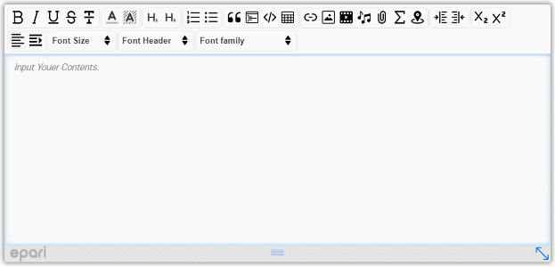
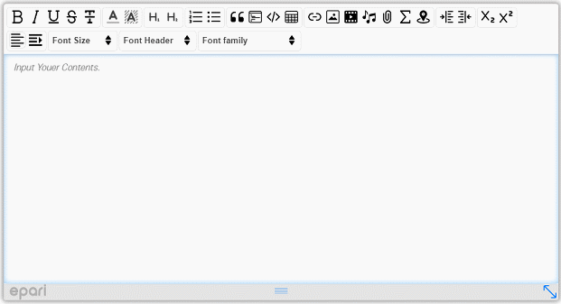
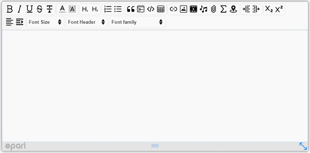
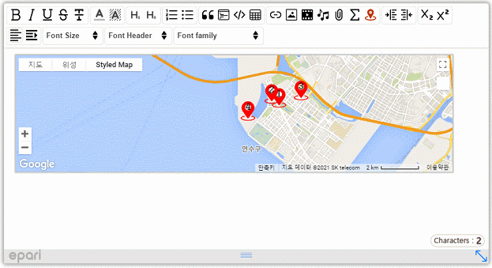
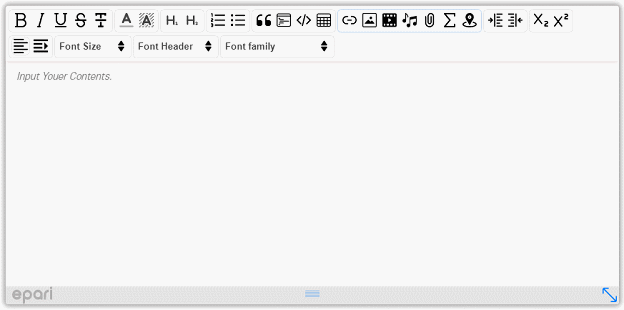
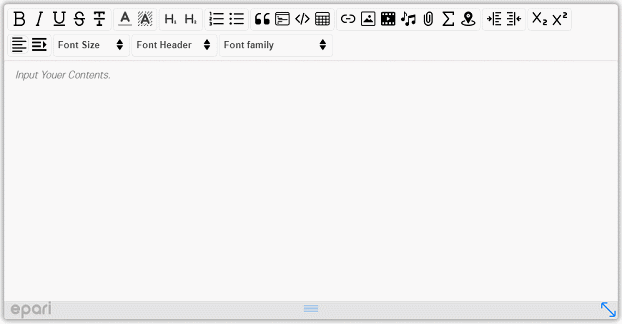

# X Editor WYSIWYG HTML 에디터
심플하고 필요한 핵심기능을 모두 갖춘 X Editor WYSIWYG HTML 에디터
 
  
### 라이브 데모
 * 데모 : <a href="https://www.epari.net/webapp/xeditor.do"         target="_blank">https://www.epari.net/webapp/xeditor.do</a>
 * 설치 : <a href="https://www.epari.net/webapp/xeditorInstall.do"  target="_blank">https://www.epari.net/webapp/xeditorInstall.do</a>
 * 문서 : <a href="https://www.epari.net/webapp/xeditorDocument.do" target="_blank">https://www.epari.net/webapp/xeditorDocument.do</a>
 
 

  
### Image(Google Drive) Example1

### Image(Local File) Example2

### KaTeX Math Symbols Example

### Link(File Attachments) Example

### Google Map Example

### OpenLayers Map Example

### Table Example

### Video youtube Example

### Video File Example

  
### X Editor 주요기능
* 기본적인 입력 서식 작성 가능(볼드, 이탤릭, 밑줄, 취소선) 및 폰트 컬러, 폰트 배경색지정을 컬러 팔래트로 쉽게 지정이 가능합니다.
* 폰트 헤더 지정, 목록 스타일, 인용부호, 라인블록 지정으로 입력 문장을 스타일쉬 하고 가독성을 높여 줍니다.
* 지원하는 Font family의 추가/삭제가 가능합니다.
* 소스코드에 대한 하이라이트 기능을 제공합니다.
* Table에 대한 간편한 rows/추가/삭제, cols/추가/삭제 및 Cell 서식/Table 서식 작업이 가능합니다.
* KaTeX지원으로 수학 공식의 입력 및 수정이 직관적으로 작성 가능합니다.
* Map(OpenLayers, Google Map, Nate Map, Naver Map)에 대한 삽입이 편리하고 원하는 위치의 마커 설정도 간편 합니다.
* 미디어 (Link, Image, Video, Audio, File)에 대해서 크기 조정 및 편리한 서식 지정이 가능합니다.
* API기능으로는 "getContent()", "getTexts()", "setContent(html)"등을 사용합니다.

  
# X Editor 라이센스
### 아래 조건을 충족할 경우 모든 사용자에게 무료 입니다.

* X editor의 지적 재산권은 epari에 있습니다.
* X editor은 개인 및 기업 사용자를 포함한 모든 사용자에게 무료로 제공되며 자유롭게 사용 하실 수 있습니다.
* X editor은 일부를 수정, 판매할 수 없으며 배포되는 형태 그대로 사용해야 합니다. 

 
